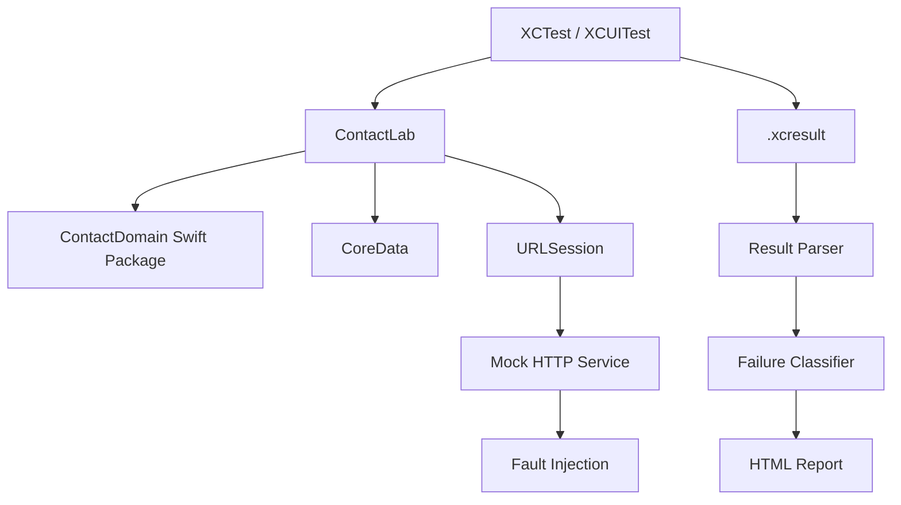

# apple-native-sdet-lab

A production-style native iOS quality engineering lab built to demonstrate **Swift + XCTest + XCUITest + CoreData + deterministic service virtualization + resilience testing + performance + reliability analytics + CI**.

> The app is intentionally small. The testing architecture is the product.

## What it demonstrates

- Native SwiftUI application engineering
- XCTest unit, networking, persistence and performance tests
- XCUITest CRUD and lifecycle automation
- Stable accessibility-identifier contracts
- CoreData persistence
- Controllable local HTTP mock service
- Network fault scenarios: HTTP 500/503, latency, timeout, malformed payload, empty response
- App foreground/background and relaunch validation
- Screenshots and UI-hierarchy failure attachments
- Reliability loops for repeated critical-path execution
- `.xcresult` normalization
- Rule-based failure classification
- HTML result generation
- GitHub Actions PR and nightly pipelines
- Swift Package Manager via the local `ContactDomain` package

## Architecture



See [docs/architecture.md](docs/architecture.md) for the full design.

## Prerequisites

- macOS
- Xcode with an iOS Simulator runtime
- Homebrew
- Python 3
- XcodeGen

Install XcodeGen:

```bash
brew install xcodegen
```

## Quick start

```bash
git clone <your-repo-url>
cd apple-native-sdet-lab
make bootstrap
open ContactLab.xcodeproj
```

Start the mock API in another terminal:

```bash
make mock
```

Health check:

```bash
curl http://127.0.0.1:8080/health
```

Run domain package tests:

```bash
make domain-test
```

Run the full iOS test suite:

```bash
make test
```

Create an HTML report from the generated `.xcresult`:

```bash
make report
open reports/index.html
```

## Reliability loop

Run the create-contact workflow 25 times:

```bash
RUNS=25 make reliability
```

Override the test:

```bash
RUNS=100 \
TEST='ContactLabUITests/ContactCRUDUITests/testCreateContact' \
make reliability
```

Output:

```text
reports/reliability/summary.csv
```

The CSV records every iteration, pass/fail status, duration and its result bundle.

## Fault injection

Normal API behavior:

```bash
curl -X POST http://127.0.0.1:8080/test/scenario \
  -H 'content-type: application/json' \
  -d '{"scenario":"normal"}'
```

Return HTTP 500:

```bash
curl -X POST http://127.0.0.1:8080/test/scenario \
  -H 'content-type: application/json' \
  -d '{"scenario":"server_error"}'
```

Simulate latency:

```bash
curl -X POST http://127.0.0.1:8080/test/scenario \
  -H 'content-type: application/json' \
  -d '{"scenario":"slow_3s"}'
```

Available scenarios are documented in [docs/test-strategy.md](docs/test-strategy.md).

## Testability hooks

The UI test harness launches the application with deterministic controls:

```text
--uitesting
--reset-data
--in-memory-store
CONTACT_API_BASE_URL=http://127.0.0.1:8080
```

This isolates test behavior without putting test-specific selectors or sleeps into product workflows.

## Accessibility contract

Production UI controls expose stable identifiers such as:

```text
contact.add
contact.sync
contact.form.firstName
contact.form.lastName
contact.form.phone
contact.form.email
contact.save
contact.delete
```

The UI tests rely on these identifiers instead of localized labels whenever possible.

## CI strategy

### Pull request

- SwiftPM domain tests
- Xcode project generation
- Mock server startup
- XCTest + XCUITest
- `.xcresult` collection
- Normalized JSON and HTML report
- Artifact upload

### Nightly

- Repeated critical-path reliability execution
- Per-run `.xcresult` bundles
- Pass-rate CSV

## Suggested next increments

- Add deterministic retry-then-success network scenarios.
- Add explicit offline-mode injection via custom `URLProtocol`/network abstraction.
- Add locale matrix (`en_US`, `de_DE`, `ja_JP`) and RTL validation.
- Add VoiceOver-oriented accessibility assertions.
- Add regression thresholds for launch/search performance.
- Add failure-history persistence with SQLite.
- Add statistical flaky-test scoring from historical runs.
- Add test-plan sharding across simulator models/OS versions.

## Resume-ready framing

**Apple Native SDET Lab — Swift, XCTest, XCUITest, CoreData, GitHub Actions**

Architected a native iOS quality engineering platform covering UI, networking, persistence, lifecycle, accessibility, performance and resilience validation. Built deterministic HTTP fault injection, testability hooks, reliability-loop execution, diagnostic artifact capture and `.xcresult` analysis to distinguish product, test and infrastructure failures.

## License

MIT
