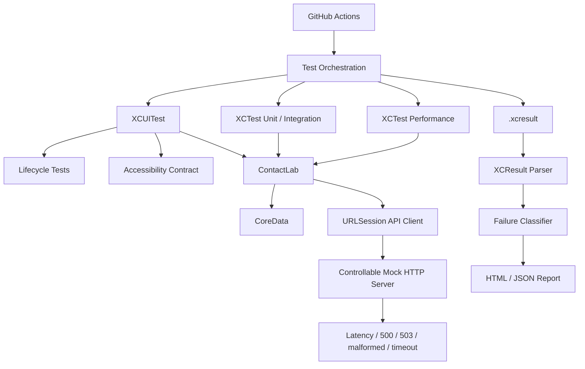

# Architecture

## Testability contract

The app exposes deterministic test hooks only through launch arguments and environment variables:

- `--uitesting`
- `--reset-data`
- `--in-memory-store`
- `CONTACT_API_BASE_URL`

UI automation selects controls through stable accessibility identifiers rather than localized visible text wherever practical.
